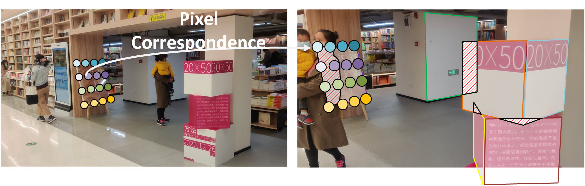

<div align="center">


#  **Multiple Planar Object Tracking**


<i>Zhicheng Zhang, Shengzhe Liu, Jufeng Yang</i>

<a href=" "></a>
[](https://iccv2023.thecvf.com/)
[](./LICENSE)
</div>




**Key motivation:** *Tracking both location and pose of multiple planar objects (MPOT) is of great significance to numerous real-world applications, including industrial, education, geometric, art, and our daily life.*


This repository contains the official implementation of our work in ICCV 2023. **MPOT-3K** dataset and the pytorch training/validation code for **tracking framework PRTrack** are released. More details can be viewed in our paper.<be>

## Publication

>**Multiple Planar Object Tracking**<br>
Zhicheng Zhang, Shengzhe Liu, Jufeng Yang<br>
<i>Proceedings of the IEEE/CVF International Conference on Computer Vision (ICCV), 2023</i>.</br>
[<a href="../assets/2023_ICCV_MPOT.pdf" target="_blank">PDF</a>]
[<a href="https://zzcheng.top/MPOT#Video" target="_blank">Video</a>]
[<a href="https://zzcheng.top/MPOT" target="_blank">Project Page</a>]
[<a href="https://github.com/nku-zhichengzhang/MPOT" target="_blank">Github</a>]
[<a href="https://github.com/nku-zhichengzhang/MPOT#mpot-3k-dataset" target="_blank">MPOT-3K Dataset</a>]
[<a href="https://zzcheng.top/MPOT#Demo" target="_blank">Demo</a>]
</br>


- [ **Multiple Planar Object Tracking**](#-multiple-planar-object-tracking)
  - [Publication](#publication)
- [ABSTRACT](#abstract)
- [DEPENDENCY](#dependency)
    - [Recommended Environment](#recommended-environment)
    - [Automatic Install](#automatic-install)
    - [Manual Install](#manual-install)
- [MPOT-3K DATASET](#mpot-3k-dataset)
  - [Data Source](#data-source)
  - [Data Format](#data-format)
  - [Annotations](#annotations)
- [SCRIPTS of PRTrack](#scripts-of-prtrack)
  - [Preparation](#preparation)
  - [Train](#train)
  - [Resume](#resume)
  - [Test](#test)
  - [Evaluation](#evaluation)
  - [Demo](#demo)
- [REFERENCE](#reference)
- [CITATION](#citation)


# ABSTRACT

Tracking both location and pose of multiple planar objects (MPOT) is of great significance to numerous real-world applications. The greater degree-of-freedom of planar objects compared with common objects makes MPOT far more challenging than well-studied object tracking, especially when occlusion occurs. To address this challenging task, we are inspired by amodal perception that humans jointly track visible and invisible parts of the target, and propose a tracking framework that unifies appearance perception and occlusion reasoning. Specifically, we present a dual-branch network to track the visible part of planar objects, including vertexes and mask. Then, we develop an occlusion area localization strategy to infer the invisible part, i.e., the occluded region, followed by a two-stream attention network finally refining the prediction. To alleviate the lack of data in this field, we build the first large-scale benchmark dataset, namely MPOT-3K. It consists of 3,717 planar objects from 356 videos and contains 148,896 frames together with 687,417 annotations. The collected planar objects have 9 motion patterns and the videos are shot in 6 types of indoor and outdoor scenes. 


# DEPENDENCY


### Recommended Environment
* CUDA 11.1
* Python 3.7
* Pytorch 1.8.1
* numpy 1.19.5
* apex 0.1

You can prepare your environment by running the following lines.

### Automatic Install
We prepare a frozen conda environment [`env`](./env.yaml) that can be directly copied.
```
conda env create -f ./env.yaml
```   
If it doesn't work, try installing the environment manually.

### Manual Install
1. create a virtual environment
```
conda create -n prtrack python=3.6.13
```

2. install torch and other
```
pip install torch==1.8.1+cu111 torchvision==0.9.1+cu111 -f https://download.pytorch.org/whl/torch_stable.html
pip install -r requirements.txt
```

3. install apex, please refer to their GitHub page [here](https://github.com/NVIDIA/apex) for more details.
```
conda install -c conda-forge cudatoolkit-dev
git clone https://github.com/NVIDIA/apex
cd apex
git checkout f3a960f80244cf9e80558ab30f7f7e8cbf03c0a0
python setup.py install --cuda_ext --cpp_ext
```

4. install DALI
```
pip install nvidia-pyindex
pip install nvidia-dali
```

We also provide our environment as a reference at [`env`](./env.yaml).


# MPOT-3K DATASET
If you need the MPOT-3K dataset for academic purposes, please download the [**application form**](./assets/MPOT-3K_Data_Access_Form.docx) and fill out the request information, then send it to ***gloryzzc6@sina.com***.
We will be sure to process your application as soon as possible.
Please make sure that the email used comes from your educational institution.

## Data Source
The collected scenes include lib, gallery, house, streetview, buildings, village. Besides, the videos are shoot under nine motion patterns that involve camera motion and target movement as follows:

|Id|Motion Pattern|
|  ----  | ----  |
1|Far-near Movement
2|In-plane Rotation
3|Out-plane Rotation
4|In-plane Movement
5|Motion Blur 
6|Camera Occlusion 
7|Unconstrained 
8|Moving Objects 
9|Moving Occlusions


## Data Format
```
MPOT-3k
├── list #splits
│   ├── test.txt
│   ├── train.txt
│   └── val.txt
├── train 
│   ├── buildings1-1
│   ├── ...
│   └── village7-9
├── test
│   ├── buildings5-1
│   ├── ...
│   └── village2-9
└── val 
    ├── buildings4-1
    ├── ...
    └── gallery2-9
        ├── gobjs #planar objects
        ├── gt #annotations
        │   ├── gt_init.txt #instances (initial frame)
        │   ├── gt_obj_init.txt #objects (initial frame)
        │   ├── gt_obj.txt #ground truth
        │   └── objects.txt
        ├── seq1 #images
        └── seqinfo.ini #video information
```

## Annotations
In gt_obj.txt, the annotation in each line includes:

&emsp;1: frame id  
&emsp;2: instance id 
&emsp;3-10: 4 points  
&emsp;11: class id
&emsp;12: object id

A simple example is listed below.

|Frame|instance|point1_x|point1_y|point2_x|point2_y|point3_x|point3_y|point4_x|point4_y|class|object|
|  ----  | ----  |  ----  | ----  |  ----  | ----  |  ----  | ----  |  ----  | ----  |  ----  | ----  |
1|1|90.0|197.3|196.0|191.3|217.3|426.0|112.0|441.3|6|1
2|1|87.6|197.4|193.6|191.4|214.9|426.1|109.6|441.4|6|1


<br><br>


# SCRIPTS of PRTrack
## Preparation


**Dataset:** After obtaining the MPOT-3K, follow the command below to extract data files from a set of zip files.
~~~~
zip mpot-3k.zip -s=0 --out mpot_single.zip
unzip -d ./ mpot_single.zip
~~~~

Adjust the local data directory in [`data.py`](libs/dataset/data.py) by replacing `ROOT` with the parent directory of MPOT-3K. For example, adjust the following lines:
~~~~
ROOT = '/mnt/sda/zzc/data/track'
~~~~


**Pre-trained Model:** Download the pretrained model from google drive [checkpoint](https://drive.google.com/file/d/1RMlu6XDMizCNmZ9zNLE8w7N3JNKgeejZ/view?usp=sharing) and place it at './ckpt/'.

## Train
You can easily train and evaluate the model by running the script below.

You can include more details such as epoch, milestone, learning_rate, etc. Please refer to [`config_train.yaml`](configs/config_train.yaml).

~~~~
python train.py --cfg ./configs/config_train.yaml
~~~~


## Resume
Please set the path of the intermediate checkpoint in [`config_train.yaml`](configs/config_train.yaml) for resume.
~~~~
resume: './ckpt/prtrack_r50/recurrent_epoch_10.pth.tar'
~~~~

## Test
Our provided script can be applied for using the trained model to track planar objects and get the corresponding prediction results.

~~~~
python test.py --cfg ./configs/config_test.yaml
~~~~
  
## Evaluation
You can evaluate the model by running the command below. The trained model can be found via Baidu Netdisk [baidu](https://pan.baidu.com/s/1-AqMBkCn36NFomOB2B8CYA?pwd=sqp3) and Google Drive [google](https://drive.google.com/file/d/12WfIHHIhOXkkQBfie8jc-AdVSFKATcsp/view?usp=sharing). More details can be viewed in [eval](./evaluation).

~~~~
cd evaluation/MPOT
python evalMPOT.py
~~~~


## Demo
We built an online demo on Gradio [here]().


# REFERENCE
We referenced the repos below for the code.

* [Cycle-STM](https://github.com/lyxok1/STM-Training)
* [SAMTrack](https://github.com/z-x-yang/Segment-and-Track-Anything)
* [MOT evaluation](https://github.com/shenh10/mot_evaluation)
* [POT](https://liangp.github.io/data/pot280/)


# CITATION

If you find this repo useful in your project or research, please consider citing the relevant publication.

````
@inproceedings{zhang2023multiple,
  title={Multiple Planar Object Tracking},
  author={Zhang, Zhichang and Liu, Shengzhe and Yang, Jufeng},
  booktitle={Proceedings of the IEEE/CVF International Conference on Computer Vision (ICCV)},
  year={2023}
}
````
